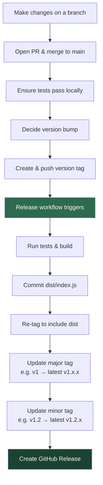

# Releasing

This describes how to release `action-dagger`.

## Release Flow



```text
 Developer                          GitHub Actions (release.yml)
 ─────────                          ────────────────────────────
    │
    ├─ 1. Make changes on branch
    ├─ 2. Open PR → merge to main
    ├─ 3. Run local checks:
    │      bun test && bun run lint && bun run build
    ├─ 4. Choose next version (semver)
    ├─ 5. Tag & push:
    │      git tag -a v1.2.3 -m "Release v1.2.3"
    │      git push origin v1.2.3
    │                                       │
    │                  ┌────────────────────►│
    │                  │                     ├─ Run tests & build
    │                  │                     ├─ Commit dist/index.js
    │                  │                     ├─ Re-tag to include dist
    │                  │                     ├─ Force-update v1 tag
    │                  │                     ├─ Force-update v1.2 tag
    │                  │                     └─ Create GitHub Release
    │                  │                              │
    │                  │              ┌───────────────┘
    │                  │              ▼
    │               Users can now reference:
    │                 @v1      ── latest v1.x.x
    │                 @v1.2    ── latest v1.2.x
    │                 @v1.2.3  ── exact pin
```

## Creating a Release

1. Ensure all tests pass:

   ```bash
   bun test
   bun run lint
   bun run build
   ```

2. Create and push a new version tag:

   ```console
   # Find the latest release
   gh release view --json tagName,publishedAt

   NEXT_VERSION=vX.Y.Z # e.g. v1.2.3

   git tag -a $NEXT_VERSION -m "Release $NEXT_VERSION"
   git push origin $NEXT_VERSION
   ```

3. The release workflow will automatically:
   - Run tests and build the project
   - Commit `dist/index.js` and re-tag to include it
   - Update the major floating tag (e.g., `v1`)
   - Update the minor floating tag (e.g., `v1.2`)
   - Create a GitHub release

## Version Bump Guide

- **Patch** (`v1.0.0` → `v1.0.1`): Bug fixes, dependency updates
- **Minor** (`v1.0.0` → `v1.1.0`): New features, backward-compatible changes
- **Major** (`v1.0.0` → `v2.0.0`): Breaking changes to inputs/outputs/behavior

## Rollback

To rollback a major tag to a previous version:

```bash
git tag -fa v1 -m "Rollback to v1.0.0"
git push origin v1 --force
```
